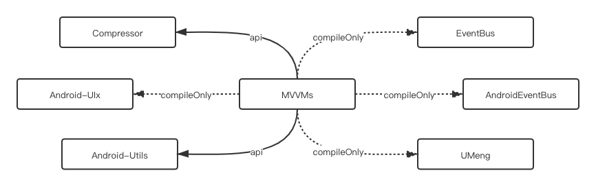
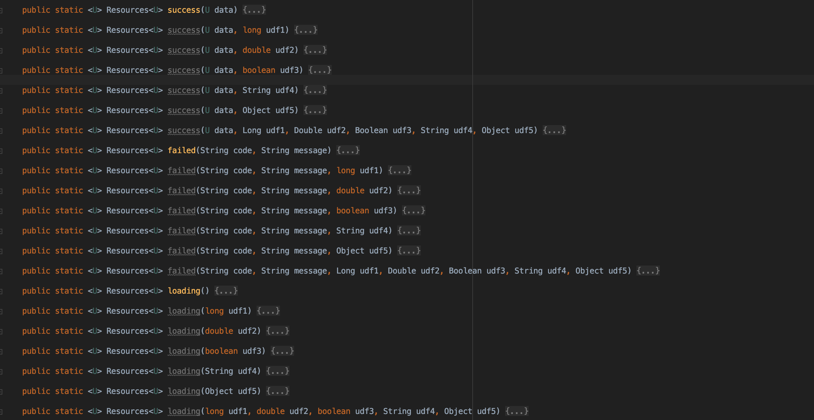
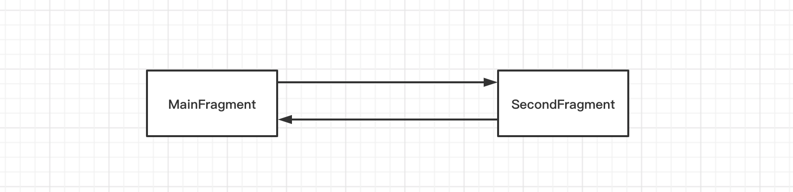
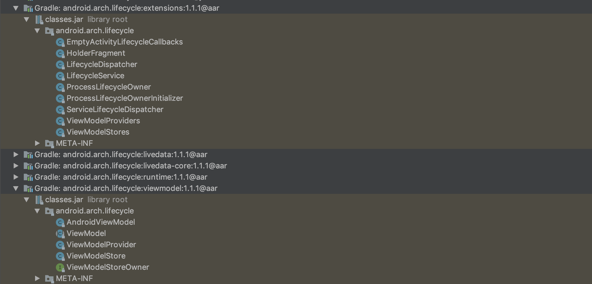
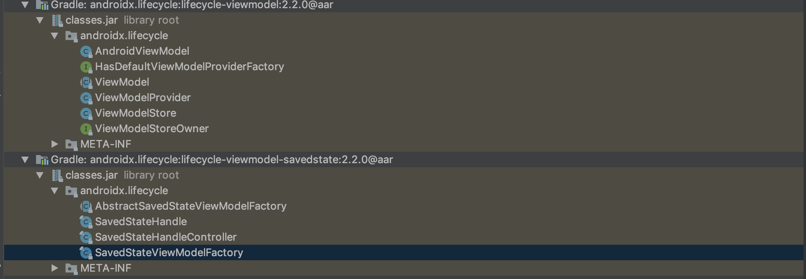

<h1 align="center">Android MVVM 快速开发框架</h1>

Jetpack 提供的 MVVM 已经足够强大，很多人会认为没有必要在其基础之上做进一步封装。正因如此，使得 MVVM 在实际应用过程中呈现出了许多千奇百怪的姿态。比如，MVVM 和 MVP 杂糅在一起，ViewModel 和 View 层混乱的数据交互格式，ViewModel 中罗列出一堆的 LiveData 等等。实际上，通过简单地封装，我们可以更好地在项目中推广和应用 MVVM。我开发 [Android-VMLib](https://github.com/Shouheng88/Android-VMLib) 这个框架的目的也正在于此。

## 1、在项目中引用

### 1.1 引入 jcenter

该库已经上传到了 jcenter 仓库。你需要在项目的 Gradle 中加入 jcenter 仓库：

```gradle
repositories { jcenter() }
```

### 1.2 添加项目依赖

然后，在项目依赖中直接引用我们的库即可：

```gradle
implementation "me.shouheng.vmlib:vmlib-core:$latest-version"
```

如果需要引入 VMLib 下面的就有 OkHttp 的文件下载模块，可以引入，

```gradle
implementation "me.shouheng.vmlib:vmlib-network:$latest-version"
```

### 1.3 对类库进行初始化

最后，在自定义 Application 中对 MVVMs 进行初始化。你只需要分别在 Application 的 `onCreate()` 方法中调用 VMLib 的对应方法即可。这样做只不过是为了我们在类库中方便调用全局的 Context，不会给你的应用的性能带来额外的开销的。

```kotlin
class App : Application() {

    override fun onCreate() {
        super.onCreate()
        // 初始化 mvvms
        VMLib.onCreate(this)
        // 工具类库个性化定制...
    }
```

### 1.4 混淆规则

```
# 使用了以下两个 EventBus 之一的话，加入对应规则
-keep class org.greenrobot.eventbus.EventBus {*;}
-keep class org.simple.eventbus.EventBus {*;}
# 使用了友盟统计的话，加入以下规则
-keep class com.umeng.analytics.MobclickAgent {*;}
# 使用了 uix 的时候加入以下规则
-keep class me.shouheng.uix.common.UIX {*;}
```

## 2、VMLib 项目实践

### 2.1 拒绝强绑定，一个 Clean 的 MVVM 框架

首先，作为一个 MVVM 的框架，Android-VMLib 所做的东西并不多，我并没有将其与各种网络框架等整合在一起，可以说得上是非常干净的一个框架。截至目前它的依赖关系如下，



也就是说，除了我的编写的图片压缩库 [Compressor](https://github.com/Shouheng88/Compressor) 以及一个工具类库 [Android-utils](https://github.com/Shouheng88/Android-utils) 之外，引入它并不会为你的项目引入更多的库。对于 EventBus，除了我们在项目中提供的一个封装之外，也不会为你引入任何类库。至于友盟，我们只不过是为你在顶层的 View 层里注入了一些事件追踪方法，也不会强迫你在项目中添加友盟依赖。也就是说，除了那两个必选的库之外，其它都是可选的。该框架的主要目的是赋能，是不是要在项目中应用完全取决于用户。

好了，接下来就详细介绍下这个类库以及正确的使用 MVVM 的姿势。

### 2.2 MVVM 和 Databinding 的暧昧关系

说到 MVVM，总是绕不开 Databinding. 我之前也了解过许多 MVVM 框架，很多都将 Databinding 作为了项目必需的方案。事实上，MVVM 和 Databinding 之间没有半毛钱的关系。

Databinding 提供了双向的绑定功能，因此很多框架直接将 ViewModel 注入到了 xml 里面。我个人是比较反感这种做法的。或许是早起 Databinding 不成熟的时候经常带来莫名其妙的编译错误 `xxx.BR not found` 以及 `can't find variable` 等，在使用 Databinding 的时候，我更多地通过它来获取控件并在代码中完成赋值。此外，xml 中的代码缺少编译时的检查机制，比如当你在 xml 中将 int 类型赋值给 String 类型的时候，它不会在编译期间报错。另外，在 xml 中能完成的业务逻辑有限，一个三目运算符 `?:` 就已经超出了代码的宽度限制。很多时候你不得不将一部分业务放在 Java 代码里，一部分代码放在 xml 里。出现问题的时候，这就增加了排查问题的难度。记得之前在项目中使用 Databinding 的时候还出现过 UI 没有及时刷新的问题，由于年代久远，具体原因我已经记不大清。最后，使用 Databinding 还可能会拖慢项目编译的速度，如果项目比较小的话或许问题不大，但对于一个模块过百的大型项目而言，这无疑是雪上加霜。

就一个框架而言，Android-VMLib 在 Databinding 上所做的工作是赋能。我们为你提供了应用 Databinding 的能力，同时也为你提供了完全排除 Databinding 的方案。以 Activity 为例，我们提供了 BaseActivity 和 CommonActivity 两个抽象类。假如你想在项目中使用 Databinding，仿造下面的类这样传入布局的 DataBinding 类，以及 ViewModel，然后通过 binding 获取控件并使用即可：

```kotlin
class MainActivity : CommonActivity<MainViewModel, ActivityMainBinding>() {

    override fun getLayoutResId(): Int = R.layout.activity_main

    override fun doCreateView(savedInstanceState: Bundle?) {
       // 通过 binding 获取控件
       setSupportActionBar(binding.toolbar)
    }
}
```

假如你不想在项目中使用 Databinding，那么你可以像下面的类这样继承 BaseActivity，然后通过传统的 findViewById 来获取控件并使用：

```kotlin
class ContainerActivity : BaseActivity<EmptyViewModel> {

    override fun getLayoutResId(): Int = R.layout.vmlib_activity_container

    override fun doCreateView(savedInstanceState: Bundle?) {
        // 通过 findViewById 来获取控件
        // 或者，引入 kotlin-android-extensions 之后直接通过 id 使用控件
    }
}
```

也许你看到了，我在使用 Databinding 的时候更多地将当作 ButterKinfe 来使用。我专门提供了不包含 Databinding 的能力，也是出于另一个考虑——使用 `kotlin-android-extensions` 之后，可以直接在代码中通过控件的 id 来使用它。如果只是想通过 Databinding 来获取控件的话，那么就没有必要使用 Databinding 的必要了。而对于确实喜欢 Databinding 的数据绑定功能的同学可以在 Android-VMLib 之上个性化封装一层。当然了，我并不是排斥 Databinding。Databinding 是一个很好的设计理念，只是对于将其大范围应用到项目中，我还是持观望态度的。

### 2.3 统一数据交互格式

有过后端开发经验的同学可能会知道，在后端代码中，我们通常会将代码按照层次分为 DAO、Service 和 Controler 层，各个层之间进行数据交互的时候就需要对数据交互格式做统一的封装。后端和前端之间的交互的时候也要对数据格式进行封装。我们将其推广到 MVVM 中，显然，ViewModel 层和 View 层之间进行交互的时候也应该进行一层数据包装。下面是我看到的一段代码，

```java
    final private SingleLiveEvent<String> toast;
    final private SingleLiveEvent<Boolean> loading;

    public ApartmentProjectViewModel() {
        toast = new SingleLiveEvent<>();
        loading = new SingleLiveEvent<>();
    }

    public SingleLiveEvent<String> getToast() {
        return toast;
    }

    public SingleLiveEvent<Boolean> getLoading() {
        return loading;
    }

    public void requestData() {
        loading.setValue(true);
        ApartmentProjectRepository.getInstance().requestDetail(projectId, new Business.ResultListener<ProjectDetailBean>() {
            @Override
            public void onFailure(BusinessResponse businessResponse, ProjectDetailBean projectDetailBean, String s) {
                toast.setValue(s);
                loading.setValue(false);
            }

            @Override
            public void onSuccess(BusinessResponse businessResponse, ProjectDetailBean projectDetailBean, String s) {
                data.postValue(dealProjectBean(projectDetailBean));
                loading.setValue(false);
            }
        });
    }
```

这里为了通知 View 层数据的加载状态定义了一个 Boolean 类型的 LiveData 进行交互。这样你需要多维护一个变量，显得代码不够简洁。实际上，通过对数据交互格式的规范，我们可以更优雅地完成这个任务。

在 Android-VMLib 当中，我们通过自定义枚举来表示数据的状态，

```java
public enum Status {
    // 成功
    SUCCESS(0),
    // 失败
    FAILED(1),
    // 加载中
    LOADING(2);

    public final int id;

    Status(int id) {
        this.id = id;
    }
}
```

然后，将错误信息、数据结果、数据状态以及预留字段包装成一个 Resource 对象，来作为固定的数据交互格式，

```java
public final class Resources<T> {
    // 状态
    public final Status status;
    // 数据
    public final T data;
    // 状态，成功或者错误的 code 以及 message
    public final String code;
    public final String message;
    // 预留字段
    public final Long udf1;
    public final Double udf2;
    public final Boolean udf3;
    public final String udf4;
    public final Object udf5;

    // ...
}
```

解释下这里的预留字段的作用：它们主要用来作为数据补充说明。比如进行分页的时候，如果 View 层不仅想获取真实的数据，还想得到当前的页码，那么你可以将页码信息塞到 udf1 字段上面。以上，我对各种不同类型的基础数据类型只提供了一个通用的选择，比如整型的只提供了 Long 类型，浮点型的只提供了 Double 类型。另外，我们还提供了一个无约束的类型 udf5.

除了数据交互格式的封装，Android-VMLib 还提供了交互格式的快捷操作方法。如下图所示，



那么，使用了 Resource 之后，代码会变成什么样呢？

```kotlin
// View 层代码
class MainActivity : CommonActivity<MainViewModel, ActivityMainBinding>() {

    override fun getLayoutResId(): Int = R.layout.activity_main

    override fun doCreateView(savedInstanceState: Bundle?) {
        addSubscriptions()
        vm.startLoad()
    }

    private fun addSubscriptions() {
        vm.getObservable(String::class.java).observe(this, Observer {
            when(it!!.status) {
                Status.SUCCESS -> { ToastUtils.showShort(it.data) }
                Status.FAILED -> { ToastUtils.showShort(it.message) }
                Status.LOADING -> {/* temp do nothing */ }
                else -> {/* temp do nothing */ }
            }
        })
    }
}

// ViewModel 层代码
class MainViewModel(application: Application) : BaseViewModel(application) {

    fun startLoad() {
        getObservable(String::class.java).value = Resources.loading()
        ARouter.getInstance().navigation(MainDataService::class.java)
            ?.loadData(object : OnGetMainDataListener{
                override fun onGetData() {
                    getObservable(String::class.java).value = Resources.loading()
                }
            })
    }
}
```

这样对数据交互格式封装之后，代码是不是简洁多了呢？至于让你的代码更加简洁，Android-VMLib 还为你提供了其它的方法，请继续阅读。

### 2.4 进一步简化代码，优化无处不在的 LiveData

之前在使用 ViewModel+LiveData 的时候，为了进行数据交互，每个变量我都需要定义一个 LiveData，于是代码变成了下面这个样子。甚至我在有的同学那里看到过一个 ViewModel 中定义了 10+ 个 LiveData. 这让代码变得非常得难看，

```java
public class ApartmentProjectViewModel extends ViewModel {

    final private MutableLiveData<ProjectDetailBean> data;
    final private SingleLiveEvent<String> toast;
    final private SingleLiveEvent<Boolean> submit;
    final private SingleLiveEvent<Boolean> loading;

    public ApartmentProjectViewModel() {
        data = new MutableLiveData<>();
        toast = new SingleLiveEvent<>();
        submit = new SingleLiveEvent<>();
        loading = new SingleLiveEvent<>();
    }

    // ...
}
```

后来我的一个同事建议我考虑下如何整理一下 LiveData，于是经过不断的推广和演化，如今这个解决方案已经比较完善——即通过 HashMap 统一管理单例的 LiveData。后来为了进一步简化 ViewModel 层的代码，我将这部分工作交给了一个 Holder 来完成。于是如下解决方案就基本成型了，

```java
public class BaseViewModel extends AndroidViewModel {

    private LiveDataHolder holder = new LiveDataHolder();

    // 通过要传递的数据类型获取一个 LiveData 对象
    public <T> MutableLiveData<Resources<T>> getObservable(Class<T> dataType) {
        return holder.getLiveData(dataType, false);
    }
}
```

这里的 Holder 实现如下，

```java
public class LiveDataHolder<T> {

    private Map<Class, SingleLiveEvent> map = new HashMap<>();

    public MutableLiveData<Resources<T>> getLiveData(Class<T> dataType, boolean single) {
        SingleLiveEvent<Resources<T>> liveData = map.get(dataType);
        if (liveData == null) {
            liveData = new SingleLiveEvent<>(single);
            map.put(dataType, liveData);
        }
        return liveData;
    }
}
```

原理很简单吧。使用了这套方案之后你的代码将会变得如下面这般简洁优雅，

```kotlin
// ViewModel 层
class EyepetizerViewModel(application: Application) : BaseViewModel(application) {

    private var eyepetizerService: EyepetizerService = ARouter.getInstance().navigation(EyepetizerService::class.java)

    private var nextPageUrl: String? = null

    fun requestFirstPage() {
        getObservable(HomeBean::class.java).value = Resources.loading()
        eyepetizerService.getFirstHomePage(null, object : OnGetHomeBeansListener {
            override fun onError(errorCode: String, errorMsg: String) {
                getObservable(HomeBean::class.java).value = Resources.failed(errorCode, errorMsg)
            }

            override fun onGetHomeBean(homeBean: HomeBean) {
                nextPageUrl = homeBean.nextPageUrl
                getObservable(HomeBean::class.java).value = Resources.success(homeBean)
                // 再请求一页
                requestNextPage()
            }
        })
    }

    fun requestNextPage() {
        eyepetizerService.getMoreHomePage(nextPageUrl, object : OnGetHomeBeansListener {
            override fun onError(errorCode: String, errorMsg: String) {
                getObservable(HomeBean::class.java).value = Resources.failed(errorCode, errorMsg)
            }

            override fun onGetHomeBean(homeBean: HomeBean) {
                nextPageUrl = homeBean.nextPageUrl
                getObservable(HomeBean::class.java).value = Resources.success(homeBean)
            }
        })
    }
}

// View 层
class EyepetizerActivity : CommonActivity<EyepetizerViewModel, ActivityEyepetizerBinding>() {

    private lateinit var adapter: HomeAdapter
    private var loading : Boolean = false

    override fun getLayoutResId() = R.layout.activity_eyepetizer

    override fun doCreateView(savedInstanceState: Bundle?) {
        addSubscriptions()
        vm.requestFirstPage()
    }

    private fun addSubscriptions() {
        vm.getObservable(HomeBean::class.java).observe(this, Observer { resources ->
            loading = false
            when (resources!!.status) {
                Status.SUCCESS -> {
                    L.d(resources.data)
                    val list = mutableListOf<Item>()
                    resources.data.issueList.forEach {
                        it.itemList.forEach { item ->
                            if (item.data.cover != null
                                && item.data.author != null
                            ) list.add(item)
                        }
                    }
                    adapter.addData(list)
                }
                Status.FAILED -> {/* temp do nothing */ }
                Status.LOADING -> {/* temp do nothing */ }
                else -> {/* temp do nothing */ }
            }
        })
    }

    // ...
}
```

这里我们通过 `getObservable(HomeBean::class.java)` 获取一个 ViewModel 和 View 层之间交互的 `LiveData<HomeBean>`，然后通过它进行数据传递。这种处理方式的好处是，你不需要在自己代码中到处定义 LiveData，将 Holder 当作一个 LiveData 池，需要数据交互的时候直接从 Holder 中获取即可。

有的同学可能会疑问，将 Class 作为从“池”中获取 LiveData 的唯一标记，会不会应用场景有限呢？Android-VMLib 已经考虑到了这个问题，下文踩坑部分会为你讲解。

### 2.5 共享 ViewModel，配置可以更简单

如果多个 ViewModel 在同一 Activity 的 Fragment 之间进行共享，那么该如何获取呢？

如果是不实用 Android-VMLib，你只需要在 Fragment 中通过 Activity 获取 ViewModel 即可，

```java
ViewModelProviders.of(getActivity()).get(vmClass)
```

使用了 Android-VMLib 之后这个过程可以变得更加简洁——直接在 Fragment 上声明一个注解即可。比如，

```kotlin
@FragmentConfiguration(shareViewModel = true)
class SecondFragment : BaseFragment<SharedViewModel>() {

    override fun getLayoutResId(): Int = R.layout.fragment_second

    override fun doCreateView(savedInstanceState: Bundle?) {
        L.d(vm)
        // Get and display shared value from MainFragment
        tv.text = vm.shareValue
        btn_post.setOnClickListener {
            Bus.get().post(SimpleEvent("MSG#00001"))
        }
    }
}
```

Android-VMLib 会读取你的 Fragment 的注解并获取 shareViewModel 字段的值，并决定使用 Activity 还是 Fragment 获取 ViewModel，以此来实现 ViewModel 的共享。是不是更加简洁了呢？

### 2.6 Android-VMLib 另一优势，强大的工具类支持

我看过很多框架，它们通常会将一些常用的工具类与框架打包到一起提供给用户使用。Android-VMLib 与之相反，我们将工具类作为独立项目进行支持。这样的目的是，1). 希望工具类本身可以摆脱对框架的依赖，独立应用到各个项目当中；2). 作为单独的模块，单独进行优化，使功能不断完善。

截至目前，工具类库 [Android-Utils](https://github.com/Shouheng88/Android-utils) 已经提供了 22 个独立的工具类，涉及从 IO、资源读取、图像处理、动画到运行时权限获取等各种功能，对于该库我会在以后的文章里进行说明。


需要说明的是，该库在开发的过程中参考了很多其它的类库，当然我们也开发了自己的特色工具类，比如运行时权限获取、主题中属性获取、字符串拼接等等。

## 3、Jetpack MVVM 踩坑实录以及 Android-VMLib 的解决方案

### 3.1 反复通知，不该来的来了

这部分涉及到 ViewModel 的实现原理，如果没有了解过其原理，可参考 [《揭开 ViewModel 的生命周期控制的神秘面纱》](https://mp.weixin.qq.com/s?__biz=MzA3MzgzMzgyNw==&mid=2247483853&idx=1&sn=692521a35ee692c6500528207621d573&chksm=9f084dc1a87fc4d75c3084683adeafb3d2c0838c8bc2ff3e387f28a3da21e9659e753628d275&token=1361179115&lang=zh_CN#rd) 一文进行了解。

以我在该项目中的示例代码为例，MainFragment 和 SecondFragment 之间共享了 SharedViewModel，在 MainFragment 当中，我们往 LiveData 中塞了一个值。然后我们跳转到 SecondFragment，从 SecondFragment 中回来的时候再次收到了这个值的通知。



很多时候我们只希望在调用 `LiveData#setValue()` 的时候通知一次数据变化。此时，我们可以通过 [SingleLiveEvent](https://github.com/android/architecture-samples/blob/dev-todo-mvvm-live/todoapp/app/src/main/java/com/example/android/architecture/blueprints/todoapp/SingleLiveEvent.java) 解决这个问题。这个类的原理并不难，只是通过 AtomicBoolean 来管理通知，当前仅当调用 `setValue()` 的时候进行通知。这解决了许多从后台回来之后页面的通知问题。

在 Andoird-VMLib 当中，当你通过 `getObservable()` 从“池”中获取 LiveData 的时候，你可以通过带 `single` 参数的方法来获取这种类型的事件，

```kotlin
// 这里通过指定 single 为 true 来使用 SingleLiveEvent
vm.getObservable(String::class.java, FLAG_1, true).observe(this, Observer {
    toast("#1.1: " + it!!.data)
    L.d("#1.1: " + it.data)
})
```

在使用 SingleLiveEvent 中的问题，

1. 从“池”中获取 LiveData 的时候只会根据第一次获取时的参数决定这个 LiveData 是不是 SingleLiveEvent 类型时。也就是说，当你第一次使用 `vm.getObservable(String::class.java, FLAG_1, true)` 获取 LiveData 之后，再通过 `vm.getObservable(String::class.java, FLAG_1)` 获取到的是同一个 LiveData.

2. SingleLiveEvent 本身存在一个问题：当存在多个观察者的时候，它只能通知给其中的一个，并且你无法确定被通知的是哪一个。这和 SingleLiveEvent 的设计原理相关，因为它通过原子的 Boolean 标记通知状态，通知给一个观察者之后状态就被修改掉了。另外，注册的观察者会被放进 Map 里，然后使用迭代器遍历进行通知，因此无法确定通知的先后顺序（哈希之后的坑位先后顺序无法确定）。

### 3.2 LiveData 的本质和本职

LiveData 本质上等同于数据本身，本职是数据缓存。

参考 [《揭开 LiveData 的通知机制的神秘面纱》](https://mp.weixin.qq.com/s?__biz=MzA3MzgzMzgyNw==&mid=2247483867&idx=1&sn=be31899e7eedd770ab181ed8aa821d94&chksm=9f084dd7a87fc4c14f5bf95e099f2925b05ab729a6bbc3c3d30fe9f5f820983e417a48ec27a2&token=1361179115&lang=zh_CN#rd) 一文，其实现原理就是在 LiveData 内部定义了一个 Object 类型的、名为 data 的对象，我们调用 `setValue()` 的时候就是为这个对象赋值。LiveData 巧妙的地方在于利用了 LifecycleOwner 的生命周期回调，在生命周期发生变化的时候通知结果给观察者。如果不熟悉 LiveData 的这些特性，编码的时候就容易出现一些问题。

以文章为例，其包含两个主要部分：标题和内容，并且两者都是 String 类型的。这就导致我们通过 `getObservable(Class<T> dataType)` 进行监听的时候，无法判断发生变化的是文章的内容还是文章的标题。因此，除了 `getObservable(Class<T> dataType)`，在 BaseViewModel 中，我们还加入了 `getObservable(Class<T> dataType, int flag)` 方法来获取 LiveData。你可以这样理解——指定不同的 Flag 的时候，我们会从不同的“池”中获取 LiveData，因此，得到的是不同 LiveData 对象。

有的同学可能会想到使用之前封装的 Resource 对象的预留字段来指定发生变化的是文章的标题还是内容。**我强烈建议你不要这么做！** 因为，正如我们上面说的那样，LiveData 和 Data 本身应该是一对一的。这样处理的结果是文章的标题和内容被设置到了同一个对象上面，内存之中只维护了一份缓存。其后果是，当页面出于后台的时候，假如你先更新了文章的标题，后更新了文章的内容，那么此时缓存之中只会保留文章的数据。当你的页面从后台回来的时候，标题就无法更新到 UI 上。还应该注意，假如一个数据分为前半部分和后半部分，你不能在修改后半部分的时候覆盖了前半部分修改的内容，这会导致前半部分修改结果无法更新到 UI。这不是 Android-VMLib 的错，很多时候不理解 LiveData 的本质和本职就容易陷到这个坑里去。

### 3.3 数据恢复问题，ViewModel 的版本差异

在 [《揭开 ViewModel 的生命周期控制的神秘面纱》](https://mp.weixin.qq.com/s?__biz=MzA3MzgzMzgyNw==&mid=2247483853&idx=1&sn=692521a35ee692c6500528207621d573&chksm=9f084dc1a87fc4d75c3084683adeafb3d2c0838c8bc2ff3e387f28a3da21e9659e753628d275&token=1361179115&lang=zh_CN#rd) 一文中，我分析了无法从 ViewModel 中获取缓存的结果的问题。这是因为早期的 ViewModel 是通过空的 Fragment 实现生命周期控制的。所以，当页面在后台被杀死的时候，Fragment 被销毁，从而导致再次获取到的 ViewModel 与之前的 ViewModel 不是同一对象。在后来的版本中，ViewModel 的状态恢复问题采用了另一种解决方案。下面是两个版本类库的差异（第一张是早期版本，第二张是近期的版本），





近期的版本抛弃了之前的 Fragment 的解决方案，改为了通过 savedstate 保存 ViewModel 的数据。这里再次提及这个问题是提醒你在开发的时候注意选择的库的版本以及早期版本中存在的问题以提前避坑。

## 4、关于

### 4.1 关于作者

你可以通过访问下面的链接来获取作者的信息：

1. Github: https://github.com/Shouheng88
2. 掘金：https://juejin.im/user/585555e11b69e6006c907a2a
3. CSDN：https://blog.csdn.net/github_35186068
4. 简书：https://www.jianshu.com/u/e1ad842673e2

### 4.2 关于项目

- [更新日志](CHANGELOG.md)

## 5、捐赠项目

我们致力于为广大开发者和个人开发者提供快速开发应用的解决方案。您可以通过下面的渠道来支持我们的项目，

<div style="display:flex;" id="target">


</div>

## License

```
Copyright (c) 2019-2020 Shouheng Wang.

Licensed under the Apache License, Version 2.0 (the "License");
you may not use this file except in compliance with the License.
You may obtain a copy of the License at

   http://www.apache.org/licenses/LICENSE-2.0

Unless required by applicable law or agreed to in writing, software
distributed under the License is distributed on an "AS IS" BASIS,
WITHOUT WARRANTIES OR CONDITIONS OF ANY KIND, either express or implied.
See the License for the specific language governing permissions and
limitations under the License.
```


