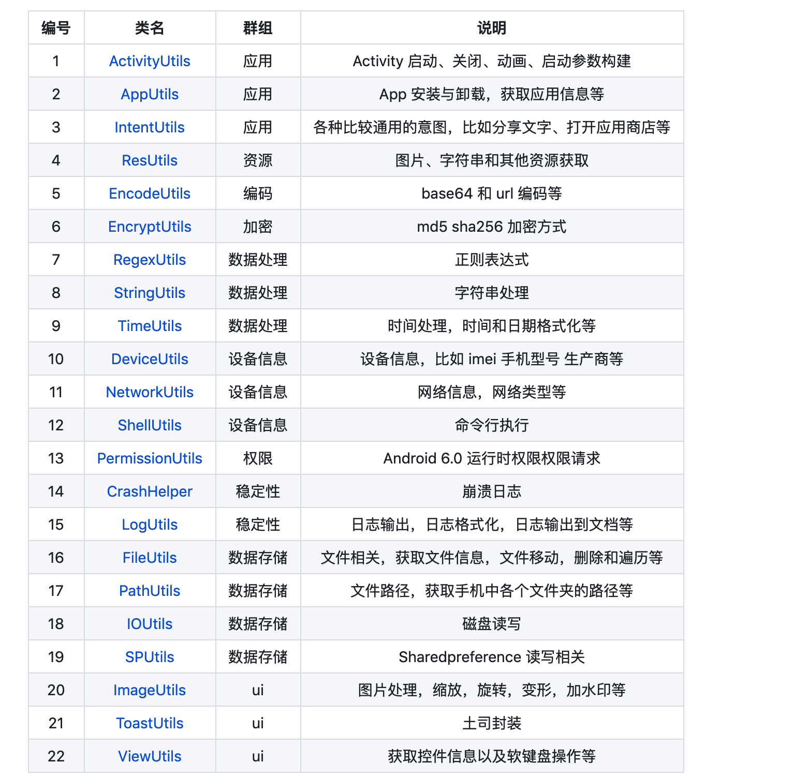

<h1 align="center">Android VMLib: 基于 Jetpack 的 MVVM 框架</h1>

<p align="center">
  <a href="http://www.apache.org/licenses/LICENSE-2.0">
    
  </a>
  <a href="https://bintray.com/beta/#/easymark/Android/vmlib-core?tab=overview">
    
  </a>
  <a href="https://www.codacy.com/manual/Shouheng88/Android-MVVMs?utm_source=github.com&amp;utm_medium=referral&amp;utm_content=Shouheng88/Android-MVVMs&amp;utm_campaign=Badge_Grade">
    
  </a>
  <a href="https://travis-ci.org/Shouheng88/Android-VMLib">
    
  </a>
    <a href="https://developer.android.com/about/versions/android-4.2.html">
    
  </a>
   <a href="https://github.com/Shouheng88">
    
  </a>
  <a target="_blank" href="https://shang.qq.com/wpa/qunwpa?idkey=2711a5fa2e3ecfbaae34bd2cf2c98a5b25dd7d5cc56a3928abee84ae7a984253">
    
  </a>
</P>

Jetpack 提供的 MVVM 已经足够强大，很多人会认为没有必要在其基础之上做进一步封装。正因如此，使得 MVVM 在实际应用过程中呈现出了许多千奇百怪的姿态。比如，MVVM 和 MVP 杂糅在一起，ViewModel 和 View 层混乱的数据交互格式，ViewModel 中罗列出一堆的 LiveData 等等。实际上，通过简单地封装，我们可以更好地在项目中推广和应用 MVVM。

## 1、在项目中引用

### 1.1 引入 jcenter

该库已经上传到了 jcenter 仓库。你需要在项目的 Gradle 中加入 jcenter 仓库：

```gradle
repositories { jcenter() }
```

### 1.2 添加项目依赖

然后，在项目依赖中直接引用我们的库即可：

```gradle
implementation "me.shouheng.vmlib:vmlib-core:$latest-version"
```

如果需要引入 VMLib 下面的就有 OkHttp 的文件下载模块，可以引入，

```gradle
implementation "me.shouheng.vmlib:vmlib-network:$latest-version"
```

### 1.3 对类库进行初始化

最后，在自定义 Application 中对 MVVMs 进行初始化。你只需要分别在 Application 的 `onCreate()` 方法中调用 VMLib 的对应方法即可。这样做只不过是为了我们在类库中方便调用全局的 Context，不会给你的应用的性能带来额外的开销的。

```kotlin
class App : Application() {
    override fun onCreate() {
        super.onCreate()
        // 初始化 mvvms
        VMLib.onCreate(this)
        // 工具类库个性化定制...
    }
}
```

### 1.4 混淆规则

```
# 使用了以下两个 EventBus 之一的话，加入对应规则
-keep class org.greenrobot.eventbus.EventBus {*;}
-keep class org.simple.eventbus.EventBus {*;}
# 使用了友盟统计的话，加入以下规则
-keep class com.umeng.analytics.MobclickAgent {*;}
# 使用了 uix 的时候加入以下规则
-keep class me.shouheng.uix.common.UIX {*;}
```

## 2、VMLib 项目实践

### 2.1 拥抱新的开发方式

在这个库中，我们尝试隐藏 LiveData，所以，假如你需要从网络中请求一个数据，那么 ViewModel 的代码将会像下面这样，

```kotlin
// me.shouheng.eyepetizer.vm.EyepetizerViewModel#requestFirstPage
fun requestFirstPage() {
    // 通知 ui 数据加载
	setLoading(HomeBean::class.java)
	eyepetizerService.getFirstHomePage(null, object : OnGetHomeBeansListener {
		override fun onError(code: String, msg: String) {
            // 通知 ui 加载失败
			setFailed(HomeBean::class.java, code, msg)
		}

		override fun onGetHomeBean(homeBean: HomeBean) {
            // 通知 ui 加载成功
			setSuccess(HomeBean::class.java, homeBean)
		}
	})
}
```

在 ui 层，我们像下面这样对数据进行监听，

```kotlin
observe(HomeBean::class.java, {
    // 成功的回调
	val list = mutableListOf<Item>()
	it.data.issueList.forEach { issue ->
		issue.itemList.forEach { item ->
			if (item.data.cover != null
				&& item.data.author != null
			) list.add(item)
		}
	}
	adapter.addData(list)
}, { /*失败 */ loading = false }, { /* 加载中 */ })
```

按照上这样开发，将使得你的代码更加简洁明了。

这样的魔力在于，我们通过 Class flag 和 Boolean 来唯一地定位一个 LiveData 然后对其进行监听。当通过 `observe` 监听或者 `setSuccess` 通知成功的时候，会根据指定的类型生成一个 LiveData，如果 Class flag Boolean 三者相同，那么 LiveData 就是同一个了。

这里的 flag 用来区别 Class 相同的情况，比如，一篇文章有标题和内容，都是 Stirng 类型，如何区分内？此时就需要使用 flag 来做区分。这里的 Boolean 用来定义 “一次性的” LiveData，所谓的 “一次性” 就是指，通知了一次之后就不会再进行第二次通知了。

除了 `observe` 类的方法，我们还提供了 `observeList` 系列的方法用来监听做 List 类型的数据的交互。

此外，你也可以使用我们老的方式，即直接通过 ViewModel 的 `getLiveData` 获取 LiveData 并进行开发，或者你也可以自己定义 LiveData. VMLib 不会干涉你的固有的开发方式。

### 2.2 工具类

VMLib 中内置了工具类库 [Android-Utils](https://github.com/Shouheng88/Android-utils)，该库提供了 22 个独立的工具类，涉及从 IO、资源读取、图像处理、动画到运行时权限获取等各种功能：



在新的版本中，我们基于 Kotlin 的一些特性开发了该工具类的拓展类 Utils-Ktx，它主要用来简化工具类的调用。我们并没有将该库内置到 VMLib 中，如果需要，你可以这样引用它，

```gradle
implementation "me.shouheng.utils:utils-ktx:$latest-version"
```

## 3、关于

### 3.1 关于作者

你可以通过访问下面的链接来获取作者的信息：

1. Github: https://github.com/Shouheng88
2. 掘金：https://juejin.im/user/585555e11b69e6006c907a2a
3. CSDN：https://blog.csdn.net/github_35186068
4. 简书：https://www.jianshu.com/u/e1ad842673e2

### 3.2 关于项目

- [更新日志](CHANGELOG.md)
- [项目背景](BACKGROUND.md)

## 4、捐赠项目

我们致力于为广大开发者和个人开发者提供快速开发应用的解决方案。您可以通过下面的渠道来支持我们的项目，

<div style="display:flex;" id="target">


</div>

## License

```
Copyright (c) 2019-2020 Shouheng Wang.

Licensed under the Apache License, Version 2.0 (the "License");
you may not use this file except in compliance with the License.
You may obtain a copy of the License at

   http://www.apache.org/licenses/LICENSE-2.0

Unless required by applicable law or agreed to in writing, software
distributed under the License is distributed on an "AS IS" BASIS,
WITHOUT WARRANTIES OR CONDITIONS OF ANY KIND, either express or implied.
See the License for the specific language governing permissions and
limitations under the License.
```


